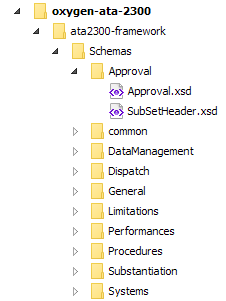

# ATA2300 Information Standards for Flight Operations Data​ Framework for oXygenXML

👋 This repository was migrated to https://github.com/acolad-digital/oxygen-ata-2300

Provides support in oXygen for working with ATA 2300 XML files.

## What is Information Standards for Flight Operations Data​

According to http://www.ataebiz.org/Pages/standards.aspx#spec2300:

> ​Spec 2300 provides a concise set of information standards and guidelines for the management, configuration and interchange of flight operations technical content, such as System Description, Dispatch Data, Procedures, Limitations, Performance, and Weight and Balance, for fixed-wing and rotorcraft. This Specification uses a modular, data-centric approach for organizing and exchanging information. This approach overcome​s the traditional paper-oriented packaging in manuals and allows information to be provided in a format and manner that is more consistent with the way the information is used in the end user’s business processes. This specification is maintained by the Flight Operations Working Group.

## How to start

- [ ] Install oXygenXML **Author** (evaluation version can be download on https://www.oxygenxml.com/xml_author.html)
- [ ] Install the oXygen ATA2300 framework by downloading the ZIP content https://github.com/Amplexor/oxygen-ata-2300/archive/master.zip or by cloning the current Github project `git clone https://github.com/Amplexor/oxygen-ata-2300.git`
- [ ] Download the package with specifications and shemas, [Spec 2300: Data Exchange Standard For Flight Operations](https://publications.airlines.org/CommerceProductDetail.aspx?Product=271). Please note that this set is **not free**. You need to purchase it or subscribe to http://www.ataebiz.org/.
- [ ] Copy the schemas (*.xsd files) in the "_schemas_" folder from the framework.
  You should end up with a file structuring looking like depicted below:
  
  
- [ ] Open the ata2300.xpr project. You should now able to author ATA2300 documents.

This framework is provided to you by [AMPLEXOR](https://www.amplexor.com) 

# Limitations

## Supported versions 

This framework currently supports **Rev 2017.1** schemas set.

## Warranty

No warranty of any kind is provided. You can however open issues in GitHub to suggest fixes, evolutions, ask questions, report errors.

# Copyright and licence

Copyright 2018-2019 AMPLEXOR

This project is licensed under [Apache License 2.0](LICENSE.txt)

